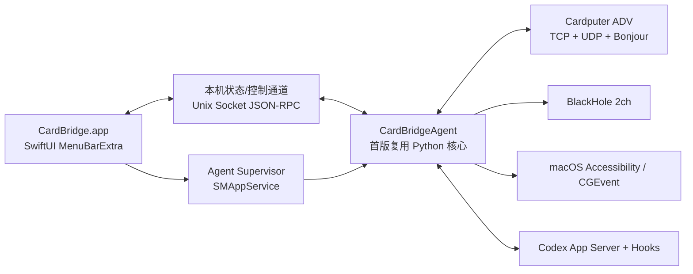

# CardBridge macOS Menu Bar App 与版本治理规划

> **Archived implementation plan.** The menu bar App described here has been
> implemented. Current installation and architecture are documented in
> [`INSTALL.md`](INSTALL.md) and [`ARCHITECTURE.md`](ARCHITECTURE.md).

> 状态：Implemented / 1.0 RC 验收中
> 日期：2026-07-15
> 范围：Mac 菜单栏 App、桥接后台、设备协议版本、发布与升级；不包含本期固件 OTA

## 1. 决策摘要

CardBridge 下一阶段不再要求用户手动创建 Python 虚拟环境、安装 `LaunchAgent`、查看日志确认连接，而是交付一个正常的 `CardBridge.app`：

- App 启动后自动启动桥接；默认可配置为登录时启动。
- 菜单栏图标直接表达“未启动、等待设备、已连接、功能降级、版本不兼容、故障”。
- 点击图标可查看 M5、键盘、音频、Codex、权限和版本状态，并完成配对、重启、更新、诊断等操作。
- 现有 Python 桥接核心先作为 App 内置的 `CardBridgeAgent` 复用，避免立即重写已验证的网络、音频和 Codex 逻辑。
- App 和 Agent 必须放在同一个签名 App Bundle、随同一个版本发布，不允许用户单独升级其中一个。
- Mac App 版本、Agent 版本、M5 固件版本、设备协议版本、配置文件版本分开管理；能否连接以“协议版本 + 能力协商”为准，不能直接比较 App 与固件的 SemVer 是否相同。
- Mac App 通过 Sparkle 更新；首期 M5 固件仍通过 USB 更新，但 App 必须显示准确的兼容性和更新指引。

推荐产品名保持 `CardBridge`，Bundle ID 暂定 `com.voltwake.cardbridge`，最低系统暂定 macOS 13。

## 2. 设计 Brief

我们在设计一个仅驻留于 macOS 菜单栏的连接工具，服务于已经拥有 Cardputer ADV、希望开机即用的个人用户。它的首要任务不是“配置很多选项”，而是让用户在 3 秒内回答三个问题：

1. 桥接是否正在运行？
2. 当前哪台 M5 已连接，键盘/音频/Codex 哪些功能可用？
3. 若不可用，下一步应该做什么？

界面应当像系统工具一样克制、可靠、可诊断。最需要消除的疑虑是：“看起来启动了，但到底有没有连上，以及是不是版本不兼容？”用户第二天应记住的特征是：菜单栏里始终有一个可信的连接状态，不再需要打开终端。

## 3. 当前实现审计

### 3.1 已有能力

- `bridge/cardbridge/server.py` 已同时承载 TCP 控制、UDP 音频、Bonjour/mDNS、配对、键盘注入和 Codex 会话推送。
- `BridgeApp` 已有明确的 `start()` / `stop()` 生命周期，适合进一步包装为后台 Agent。
- 配对使用 32 字节随机 token，配置文件权限为 `0600`。
- 未知 TCP 消息会被忽略，已有一定的前向兼容基础。
- 现有模拟器覆盖配对、键盘、音频、Codex 请求和重连。
- 从仓库根目录运行正确测试命令时，当前 29 个 Python 测试全部通过：

```sh
PYTHONPATH=bridge:. bridge/.venv/bin/python -m unittest discover -s bridge/tests -v
```

### 3.2 现有问题

- 当前服务依赖仓库目录、Python 3.10、`.venv` 和用户目录下的手工 `LaunchAgent`，不能作为普通 Mac 产品分发。
- UI 没有状态数据源，只能通过进程、端口和日志间接判断健康状态。
- 配对码输出到终端/日志和系统通知，没有统一的 App 内配对流程。
- `pyproject.toml` 与 `cardbridge.__version__` 固定为 `0.1.0`，固件没有正式版本常量。
- 配置文件中的 `version=1` 是配置 schema，但没有明确命名，容易与协议版本混淆。
- mDNS TXT 只有固定 `version=1`；设备的 `hello` 和桥接的 `hello_ok` 没有固件、App、协议和能力字段。
- 当前版本不兼容只能表现为反复断线、认证失败或消息字段缺失，用户无法区分网络、权限和版本问题。
- 当前机器只有 Xcode Command Line Tools，没有完整 Xcode；开始 SwiftUI App 开发前需要安装完整 Xcode。

## 4. 产品范围

### 4.1 首版必须完成

- 菜单栏常驻与登录启动。
- 桥接 Agent 自动启动、崩溃恢复和手动重启。
- 查看当前 M5 连接、IP、最后在线时间、信号、固件和协议版本。
- 查看键盘权限、音频输出、Codex App Server、Codex Hooks 状态。
- App 内展示配对码、取消配对和重新配对。
- 明确显示版本兼容、功能降级与必须升级。
- 从现有 `~/.cardbridge` 和 `local.cardbridge.service` 无损迁移。
- Mac App 自动更新、签名、Notarization 和可复现发布。

### 4.2 首版不做

- 不做完整 Dock App 或复杂仪表盘。
- 不做 Mac App Store 分发；首期使用 Developer ID 直接分发。
- 不做 M5 OTA；先提供 USB 更新引导和固件文件校验。
- 不在本期重写全部 Python 桥接逻辑。
- 不改变“一台 M5 同时只控制一台 Mac”的设备约束。

## 5. 菜单栏交互方案

Apple 的 `MenuBarExtra` 适合持续访问的小工具，`.window` 样式可承载比普通菜单更丰富的连接状态。App 设置 `LSUIElement=true`，不显示 Dock 图标。

### 5.1 菜单栏状态

菜单栏图标使用单色 template 图形，状态同时通过图形变化、短文案和 VoiceOver 标签表达，不只依赖颜色。

| 状态 | 图标/标签 | 面板主文案 | 主操作 |
|---|---|---|---|
| Starting | 呼吸/省略符号 | 正在启动桥接 | 等待或查看日志 |
| Ready | 空心连接图标 | 桥接已启动，等待 M5 | 打开配对/设备设置 |
| Pairing | 数字徽标 | 等待输入配对码 | 取消配对 |
| Connected | 实心连接图标 | 已连接到 Cardputer ADV | 查看功能状态 |
| Degraded | 感叹号徽标 | 已连接，部分功能不可用 | 修复权限/安装 BlackHole |
| Incompatible | 上箭头徽标 | 版本不兼容 | 更新 App 或固件 |
| Error | 断开图标 | 桥接启动失败 | 重试/导出诊断 |
| Stopped | 斜线图标 | 桥接已停止 | 启动桥接 |

### 5.2 面板布局

首版面板宽度建议约 340 px，只展示一层核心信息；详细设置使用独立 Settings 窗口。

```text
┌────────────────────────────────────┐
│ CardBridge                 已连接 ● │
│ chaosdeMacBook-Air   App 0.2.0      │
├────────────────────────────────────┤
│ Cardputer ADV                       │
│ 192.168.198.167   Wi-Fi -42 dBm     │
│ 固件 0.2.0  ·  协议 2.0  ·  兼容    │
├────────────────────────────────────┤
│ ✓ 键盘   已授权                     │
│ ✓ 音频   BlackHole 2ch · 正在传输   │
│ ✓ Codex  8 个任务 · Hooks 正常       │
├────────────────────────────────────┤
│ [停止桥接]              [设置…]     │
│ 检查更新…   导出诊断…   退出         │
└────────────────────────────────────┘
```

未连接时，中间设备卡替换为“等待 M5”，并显示最近设备、配对按钮和具体故障原因。多台 M5 同时连接时设备卡改为可展开列表，但首屏仍只显示设备数量与最需要处理的状态。

### 5.3 首次启动流程

1. App 启动并注册内置 Agent。
2. 发现旧安装时，导入 bridge ID、配对 token、音频设置和 Codex Hook 配置。
3. 停止并移除旧的 `local.cardbridge.service`，防止端口冲突。
4. Agent 立即开始监听；缺少某项权限不应阻止其他功能启动。
5. 面板逐项检测并引导：本地网络/Bonjour、Accessibility、BlackHole、Codex Hooks。
6. 已配对的 M5 自动重连；新设备在面板中展示 6 位配对码。
7. 首次成功连接后显示一次简短确认，不重复弹窗。

### 5.4 版本不兼容流程

- App 与 M5 仍应完成最小握手并交换版本，随后发送结构化 `upgrade_required`，不能直接静默断线。
- 面板必须同时显示“当前版本”“需要的版本”“受影响功能”和“更新按钮/步骤”。
- 次版本或可选能力差异允许降级连接，例如没有 `agents.phase.v1` 时仍显示任务，只不区分 Thinking/Tool。
- 协议主版本不兼容或存在安全下限时才阻止进入 authenticated 状态。

## 6. 目标架构



### 6.1 `CardBridge.app`

- SwiftUI + 少量 AppKit，使用 `MenuBarExtra(...).menuBarExtraStyle(.window)`。
- 只负责展示、用户操作、更新器、设置和 Agent 生命周期，不直接解析日志。
- 使用 `SMAppService` 管理随 App Bundle 分发的 Agent，替代手工写入 `~/Library/LaunchAgents`。
- 登录启动默认开启，但设置页允许关闭。
- 负责 App/Agent 内部版本校验；同一个 Bundle 内两者 build 不一致时自动重新注册 Agent。

### 6.2 `CardBridgeAgent`

- 首版冻结现有 Python 包为自带运行时的独立可执行文件，用户机器不再需要 Python、pip、venv 或仓库源码。
- 保留现有 TCP/UDP、mDNS、音频、键盘、Codex 和测试逻辑。
- 新增结构化状态模型和本地控制 API。
- 作为稳定签名的内置 Agent 请求 Accessibility，避免每次源码路径变化导致权限项变化。
- Agent 打包、Hardened Runtime、Universal Binary、PyObjC/PortAudio 签名必须先做技术验证；若失败，再将键盘/音频等高风险部分迁移到 Swift，而不是先重写全部功能。

### 6.3 App 与 Agent 的本地接口

首版使用用户专属目录中的 Unix Domain Socket，目录权限 `0700`、socket 权限 `0600`，并验证 peer UID。接口使用行分隔 JSON，独立于 M5 设备协议。

Agent 主动推送 `BridgeSnapshot`：

- Agent 状态、监听端口、LAN 地址、启动时间、版本、最近错误。
- 已连接/最近设备、IP、RSSI、固件、协议、能力、最后心跳。
- 键盘权限、音频设备、音频流、丢帧统计。
- Codex App Server、Hooks、会话数量和额度可用性。
- 更新兼容性结果。

App 可发送：

- `start` / `stop` / `restart`
- `pair_cancel` / `unpair`
- `set_audio_device` / `set_gain`
- `install_hooks` / `uninstall_hooks`
- `diagnostics_export`

该接口有自己的 `agent_api_version`；因为 App 与 Agent 必须同包发布，首版要求 API 主版本一致，不做跨多个 App 版本的长期兼容。

### 6.4 数据与迁移

目标路径：

- 非敏感配置：`~/Library/Application Support/CardBridge/config.json`
- 配对 token：macOS Keychain
- 日志：Unified Logging；导出诊断时生成脱敏文本包
- UI 偏好：`UserDefaults`

首次迁移必须保留现有 `bridge_id` 和设备 token，使已经配对的 M5 无需重新配对。确认新 Agent 成功监听后才移除旧 LaunchAgent；任一步失败都回滚，不删除 `~/.cardbridge` 原数据。

## 7. 版本模型

### 7.1 五类版本必须分开

| 名称 | 示例 | 用途 | 兼容判断 |
|---|---|---|---|
| Product Release | `0.2.0` | 一次发布的总版本/Tag | 只用于发布追踪 |
| Mac App / Agent | `0.2.0 (42)` | UI、后台实现与 Sparkle 更新 | App 与内置 Agent build 必须一致 |
| Firmware | `0.2.0+d0efbac` | M5 固件追踪和更新提示 | 由兼容策略判断，不要求等于 App |
| Device Protocol | `2.0` | M5 与 Agent 的 wire contract | 主版本必须一致，次版本协商 |
| Config Schema | `2` | 本地持久化迁移 | 只允许显式、可回滚迁移 |

### 7.2 单一版本源

仓库根目录新增 `version.json`，其他语言的常量全部由脚本生成，禁止在 `pyproject.toml`、Python、Swift、C++ 中手工重复修改。

示例：

```json
{
  "release": "0.2.0",
  "mac_app": {"version": "0.2.0", "build": 42},
  "agent_api": {"major": 1, "minor": 0},
  "firmware": {"version": "0.2.0"},
  "device_protocol": {"major": 2, "minor": 0},
  "config_schema": 2,
  "compatibility": {
    "min_firmware": "0.1.0",
    "legacy_protocol_1": true
  }
}
```

CI 生成并检查：

- Swift `GeneratedVersion.swift`
- C++ `src/generated_version.h`
- Python `cardbridge/_generated_version.py`
- App `CFBundleShortVersionString` 与递增的 `CFBundleVersion`
- 发布用 `compatibility.json`

### 7.3 设备握手 v2

mDNS TXT 仅用于发现和预览，增加简短字段：`pmaj`、`pmin`、`app`；最终兼容性以 TCP 握手为准。

M5 → Agent：

```json
{
  "t": "hello",
  "dev_id": "50787dceb3cc",
  "token": "<redacted>",
  "device": {
    "model": "cardputer-adv",
    "firmware": "0.2.0",
    "build": "d0efbac"
  },
  "protocol": {"major": 2, "minor": 0},
  "capabilities": [
    "control.keys.v1",
    "audio.pcm16-16k.v1",
    "agents.snapshot.v1",
    "agents.phase.v1",
    "quota.v1"
  ]
}
```

Agent → M5：

```json
{
  "t": "hello_ok",
  "mac_id": "54927d1228c14307a117dc1c4f891080",
  "mac_name": "chaosdeMacBook-Air",
  "udp_port": 7789,
  "app": {"version": "0.2.0", "build": 42},
  "protocol": {"major": 2, "minor": 0},
  "capabilities": [
    "control.keys.v1",
    "audio.pcm16-16k.v1",
    "agents.snapshot.v1",
    "agents.phase.v1",
    "quota.v1"
  ],
  "compatibility": "ok"
}
```

不兼容响应：

```json
{
  "t": "upgrade_required",
  "reason": "protocol_major",
  "current": {"firmware": "0.1.0", "protocol_major": 1},
  "required": {"min_firmware": "0.2.0", "protocol_major": 2}
}
```

### 7.4 兼容规则

1. 主版本一致：允许连接。
2. 次版本不同：协商 `min(local_minor, remote_minor)`，只启用双方 capabilities 交集。
3. 缺少版本字段：视为 legacy protocol 1，而不是解析失败。
4. 协议主版本不同：发送 `upgrade_required` 后再关闭连接。
5. App/Firmware SemVer 不相等本身不是错误；只作为兼容策略和提示依据。
6. 配对 token 在普通更新中继续有效；只有 token 格式或安全模型变化才要求重新配对。
7. 安全修复可在 `compatibility.json` 中设置最低固件/App 版本，但必须给出明确原因。

迁移顺序：先让新版 Agent 同时支持 protocol 1/2，再发布携带 protocol 2 字段但仍能接受 legacy `hello_ok` 的固件。至少跨两个正式 Product Release 保留 protocol 1，确认设备升级率后再移除。

## 8. 更新与发布

### 8.1 Mac App

- 使用 Sparkle 2，更新包通过 HTTPS 和 EdDSA 签名。
- App Bundle 使用 Developer ID Application 签名、Hardened Runtime、Apple Notarization，并 stapling ticket。
- Sparkle 依据递增 `CFBundleVersion` 判断新旧；用户可在菜单中“检查更新”。
- 更新前 Agent 优雅停止；App 重启后 Agent 自动注册并让 M5 重连。
- 更新不得覆盖 bridge ID、Keychain token、用户设置或 Codex Hooks。

### 8.2 固件

首期每个 Product Release 同时发布：

- `CardBridge-x.y.z.dmg` 或 `.zip`
- `cardputer-adv-firmware-x.y.z.bin`
- `compatibility.json`
- SHA-256 校验文件
- Release Notes

App 检测到旧固件时显示当前/目标版本，并提供 USB 更新入口。后续如实现 OTA，仍复用同一版本与兼容模型，不改变握手语义。

### 8.3 CI Release Gate

发布 Tag 触发：

1. 检查 `version.json` 与生成文件一致且工作区无差异。
2. 运行 Python 单元测试、协议兼容矩阵和 fake-device E2E。
3. 编译、测试 M5 固件并记录 Flash/RAM 预算。
4. 构建和测试 macOS App/Agent，验证 arm64；公开分发前补齐 x86_64 或明确仅支持 Apple Silicon。
5. 验证 App/Agent build 完全一致。
6. Developer ID 签名、Notarization、staple、`codesign --verify`、`spctl`。
7. 生成 Sparkle appcast、EdDSA 签名和 release manifest。
8. 从干净 Mac 安装包完成一次真实 M5 升级/重连验收后发布。

## 9. 建议仓库结构

```text
macos/
├── CardBridge.xcodeproj
├── CardBridgeApp/
│   ├── App/
│   ├── MenuBar/
│   ├── Settings/
│   ├── AgentClient/
│   └── Updates/
├── CardBridgeAgent/
│   ├── packaging/
│   └── Resources/
└── CardBridgeTests/

bridge/
├── cardbridge/
│   ├── server.py
│   ├── status.py          # 新增：BridgeSnapshot
│   ├── control_server.py  # 新增：本机 UI/Agent API
│   └── versioning.py      # 新增：协议/能力协商
└── tests/

version.json
tools/generate_versions.py
```

## 10. 实施阶段

### M0 — 版本与基线先行

- 新增 `version.json`、生成脚本和版本一致性测试。
- 给当前 Python Bridge 和 M5 加入 protocol v2 字段、能力协商、legacy v1 兼容和 `upgrade_required`。
- 将配置 `version` 明确重命名/迁移为 `config_schema`。
- 修正文档中的测试入口，确保从干净环境一条命令运行全部测试。

验收：新 Bridge 可连接当前旧固件；新固件可连接当前旧 Bridge；不兼容测试能收到可解释错误。

### M1 — Bridge 可观测与可控制

- 抽出 `BridgeSnapshot`，所有核心模块提供结构化健康状态。
- 新增本地 Agent 控制接口和事件订阅。
- 配对码成为事件，不再只能从 stdout 获取。
- 添加设备连接、音频、权限、Codex、Agent 崩溃恢复测试。

验收：不读取日志即可完整判断 UI 所需状态。

### M2 — Menu Bar Alpha

- 安装完整 Xcode，创建 SwiftUI macOS 13+ 工程。
- 实现 MenuBarExtra、状态图标、主面板和 Settings。
- 完成内置 Python Agent 的打包、启动、停止、重启与 IPC。
- 使用 `SMAppService` 管理 Agent 与登录启动。
- 先完成 Developer ID 本地签名/TCC 技术验证，再进行视觉打磨。

验收：在没有仓库、Python 和 venv 的用户账户中，双击 App 后可桥接真实 M5。

### M3 — 迁移与权限体验

- 导入 `~/.cardbridge`，安全迁移 token 到 Keychain。
- 移除旧 LaunchAgent，处理端口占用和回滚。
- 完成 Accessibility、BlackHole、本地网络和 Codex Hooks 引导。
- 加入脱敏诊断导出。

验收：现有已配对设备升级 App 后无需重新配对，键盘/音频/Codex 全部恢复。

### M4 — 更新与发布流水线

- 接入 Sparkle、appcast、EdDSA、更新设置和 Release Notes。
- 建立 Developer ID 签名、Notarization、staple 和 CI Release Gate。
- 同步发布固件、兼容 manifest 和 SHA-256。

验收：从上一个已发布版本升级 App 后自动重连；不兼容固件能得到准确提示。

### M5 — Beta 硬化

- 睡眠/唤醒、换 Wi-Fi、VPN、Agent 崩溃、Codex 未安装、BlackHole 缺失测试。
- RC 使用短时真实设备连接/音频稳定性与崩溃恢复测试；24 小时 soak 仅作为后续公开 Beta 的可选门槛。
- 升级中断、配置迁移失败、签名/权限保持测试。
- 完成中英文界面、VoiceOver、键盘导航与对比度检查。

验收：满足第 11 节全部产品级验收标准后发布 1.0 候选版。

## 11. 产品级验收标准

- 登录后 5 秒内菜单栏出现 CardBridge，桥接进入 Ready。
- 已配对且同网的 M5 在 30 秒内自动重连。
- 面板连接状态与真实 TCP 状态一致，不出现“显示已连接但 socket 已断”的情况。
- 用户无需安装 Python、执行脚本或查看终端。
- Agent 崩溃后自动恢复，UI 清楚显示恢复过程。
- 已连接但 Accessibility、BlackHole 或 Hooks 缺失时显示 Degraded，而不是笼统 Error。
- protocol 主版本不兼容时不进入无限重连，双方均保留可诊断状态。
- App 更新、Agent 重启、Mac 重启后配对 token 和用户设置不丢失。
- App/Agent 构建版本不一致时拒绝正常运行并自动修复注册。
- 配对 token 不出现在普通日志、诊断包或 UI 中。
- App 完成签名、Notarization、更新签名和干净机器安装验证。

## 12. 风险与处理

| 风险 | 处理 |
|---|---|
| Python/NumPy/PyObjC/PortAudio 打包后体积大或 Notarization 复杂 | M2 最先做签名与真实权限 spike；失败时只迁移有问题的模块到 Swift |
| Agent 更新后 Accessibility 权限失效 | 固定 Bundle ID、签名 identity 和 Agent 安装路径；每个发布候选都做权限保持回归 |
| App 与旧 LaunchAgent 同时监听 7788/7789 | 迁移先检测 PID/路径，成功启动新 Agent 后再移除旧项，失败可回滚 |
| mDNS 在多网卡/VPN 下广播错误地址 | 状态中显示实际广告地址；保留主 LAN 选择逻辑并增加接口切换测试 |
| 固件未升级导致新功能字段缺失 | legacy v1 兼容 + capabilities 降级，不以缺字段直接断开 |
| 更新过程中 M5 暂时断连 | 更新前主动通知/停止 Agent，更新后自动恢复，UI 显示“正在重新连接” |
| Codex CLI、App Server 或 Hooks 行为变化 | 将 Codex 作为独立健康子系统；失败不阻断键盘和音频 |

## 13. 开工前需要确认的产品选项

以下均有推荐默认值，不阻塞 M0/M1：

- 产品名：`CardBridge`（推荐）
- Bundle ID：`com.voltwake.cardbridge`（推荐）
- 最低系统：macOS 13（推荐，便于使用 MenuBarExtra 与 SMAppService）
- 默认登录启动：开启（推荐）
- 分发：GitHub Releases + Sparkle appcast（推荐；后续可迁移独立域名）
- CPU：首个内部 Alpha 先 arm64；公开 Beta 前决定是否提供 Universal 2

## 14. 技术依据

- Apple `MenuBarExtra`：<https://developer.apple.com/documentation/swiftui/menubarextra>
- Apple `SMAppService`：<https://developer.apple.com/documentation/servicemanagement/smappservice>
- Apple `CFBundleShortVersionString`：<https://developer.apple.com/documentation/bundleresources/information-property-list/cfbundleshortversionstring>
- Apple Accessibility trust：<https://developer.apple.com/documentation/applicationservices/1459186-axisprocesstrustedwithoptions>
- Apple Bonjour services：<https://developer.apple.com/documentation/bundleresources/information-property-list/nsbonjourservices>
- Apple Notarization：<https://developer.apple.com/documentation/security/notarizing-macos-software-before-distribution>
- Sparkle 2 documentation：<https://sparkle-project.org/documentation/>
